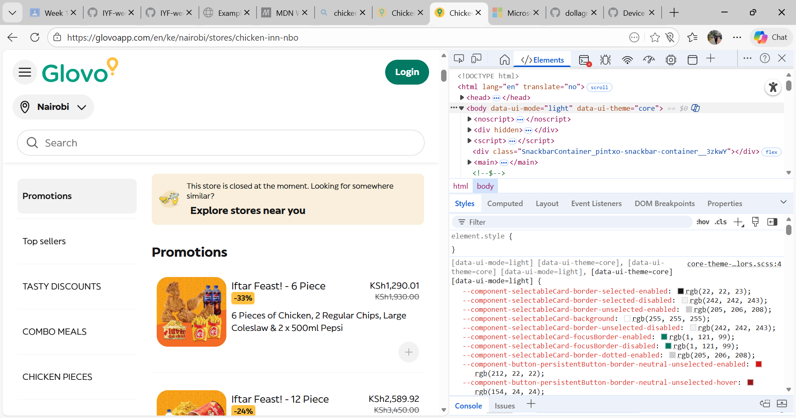

# DevTools Exploration 
## Website 1: https://example.com 
- HTML tags used: `<head>`, `
`, `<a>`, `<meta>`,`<title>`,`<link>`,`<body>`,`<h1>`
- Page title: "Example Domain" 
- Number of headings: 1
## Website 2: https://developer.mozilla.org 
- Navigation menu is wrapped in: `<nav>` 
- Search bar structure: `<form>` with `<input type="search">
- Hover effect: Cursor changes to a pointer/Links change color/underline when hovered
## Website 3: Website of my choice https://glovoapp.com/en/ke/nairobi/stores/chicken-inn-nbo
-  5HTML elements: `<h2>`, `
`, ``, `<a>`, `
`
-Form element: <input class="BaseInput_pintxo-base-input__input__UbR_4 pintxo-typography-body1" data-rtl="false" type="search" placeholder="Search" aria-invalid="false" value="">

